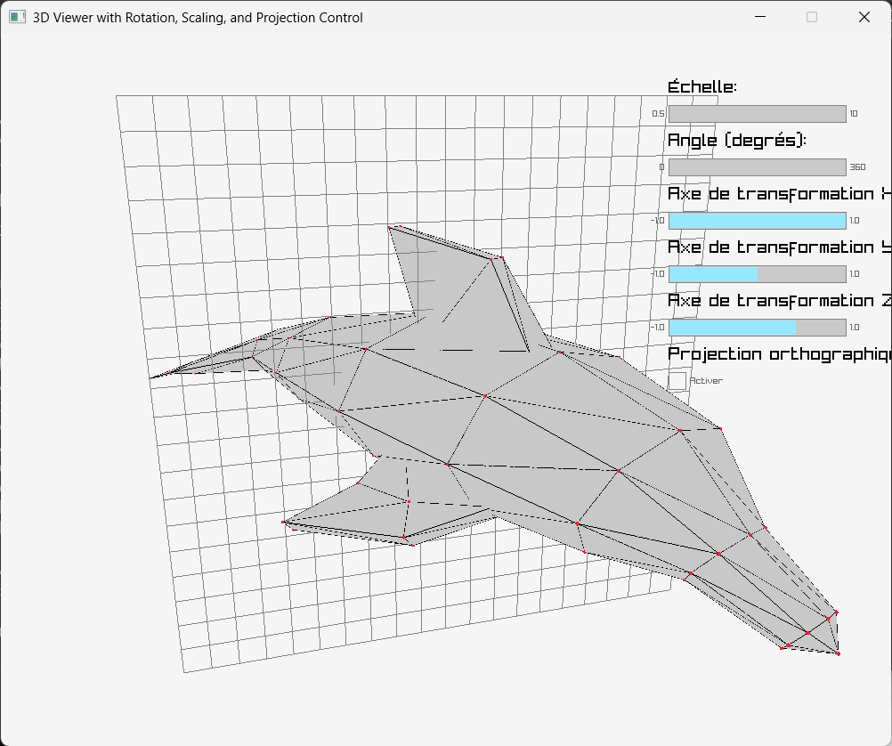
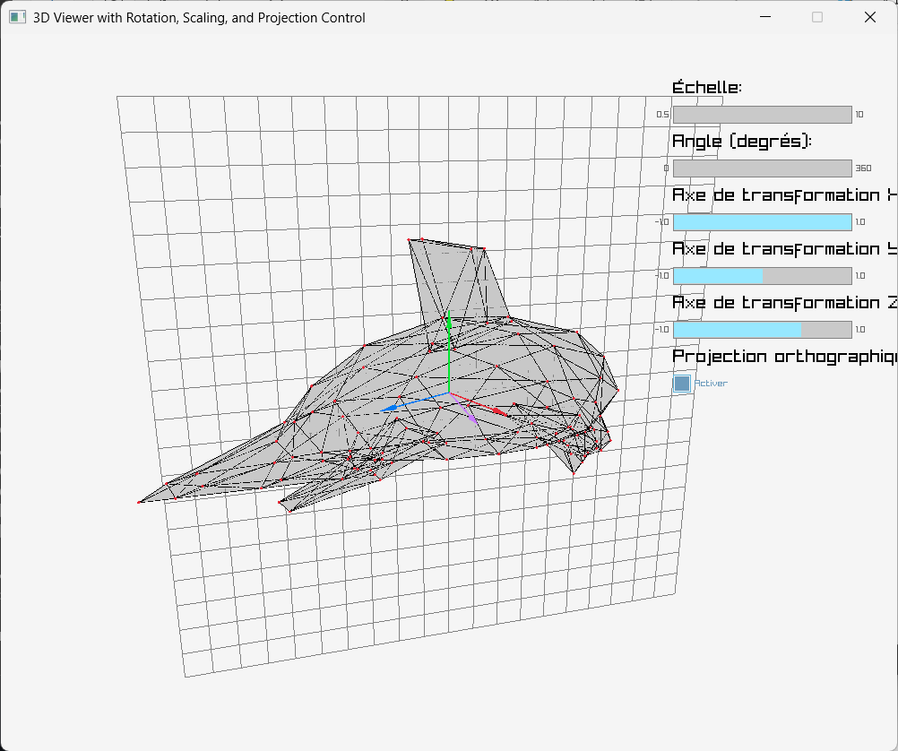
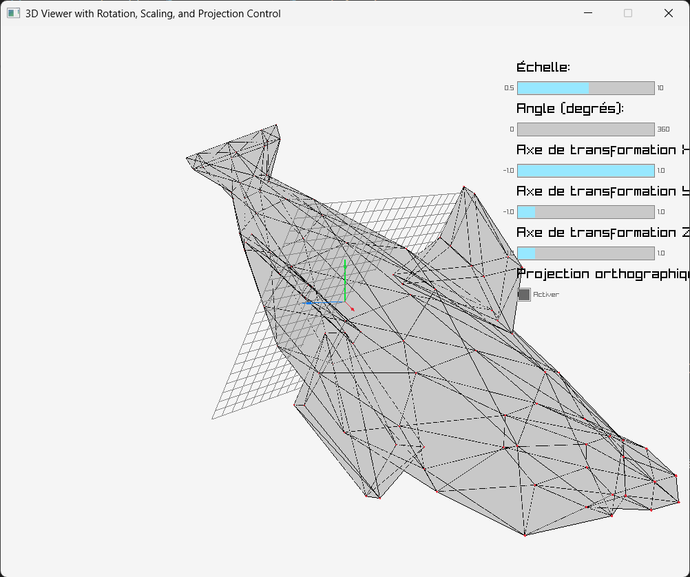

# Context

Instructions available in [sujet.pdf](./sujet.pdf).

# Requirements

1. Install Python
2. Install Python libraries

```bash
pip install numpy trimesh raylib
```

# Run programs


Run exercices:

```bash
python exoA.py
```

Replace `A` by the number of the target exercice.

# Results

## Exercice 1






## Exercice 2

```python
def apply_transformations(mesh, rotation_mat, scaling_mat, projection_mat):
    """Applique les transformations de rotation, de mise à l'échelle et de projection aux sommets du mesh."""
    mesh.vertices = mesh.original_vertices @ projection_mat.T @ rotation_mat.T @ scaling_mat.T
```

On constate que le projection ne fonctionne plus lorsqu'elle n'est pas appliquée en dernière.


